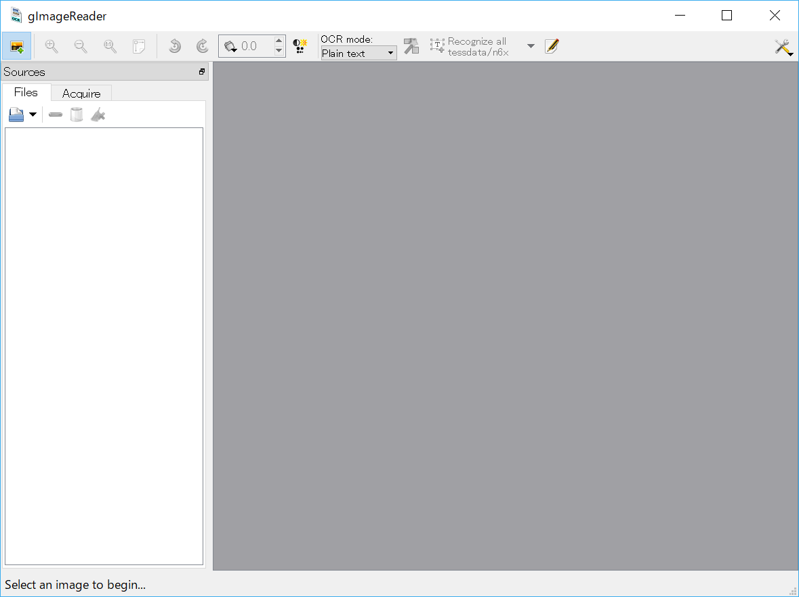
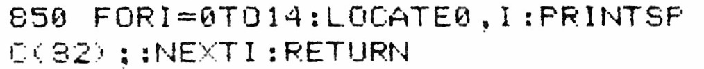
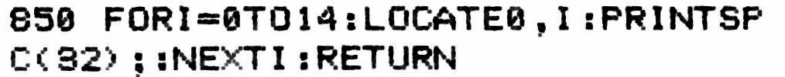
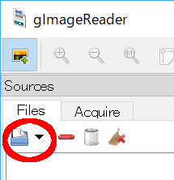
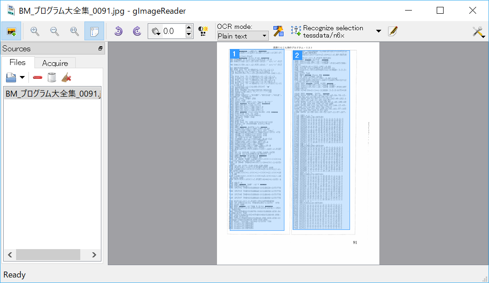
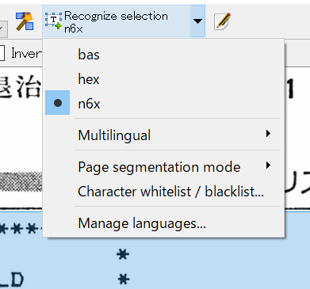
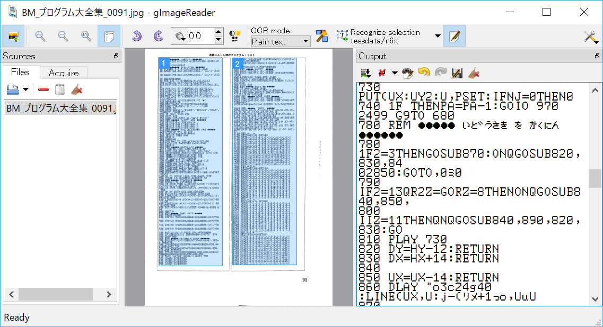

= Program List OCR
eighttails <http://eighttails.seesaa.net>
:toc: left
:numbered:
:data-uri:

== What is this?
////
本ソフトは、主に1980年代のパソコン雑誌に掲載されたプログラムリストの読み取りに特化したOCRです。 +
紙面をスキャナで取り込み、OCRでテキストファイルにしたものをエミュレーター用のテープイメージ等に変換するという使い方を想定しています。 +
本ソフトは、以下のオープンソースソフトウェアの組み合わせです。
* Tesseract(OCRエンジン)
* gImageReader(GUIフロントエンド)
////
Program List OCR is a OCR(Optical Character Recognition) software which is specific to computer program listings published in 1980's. +
It converts scanned program listing images to text file. You can convert text to emulator's input file, e.g. casette tape image +  
Program List OCR is a compilation of following open souce softwares. +

* Tesseract(OCR engine)
* gImageReader(GUI frontend)

////
上記に加えて、独自にOCRに学習させて作成した以下の言語ファイルを含んでいます。

* BASIC(PC-6001シリーズ用N6X-Basic)
* 16進ダンプリスト
////
And it also contains special OCR language model files. 
* BASIC(Generic Basic Langauge)
* N6X-BASIC(BASIC for NEC PC-6001(Japanese))
* Hexadecimal machine language

BASIC(bas) model is for generic BASIC language listings. It recognizes ASCII printable characters. +
N6X-BASIC(n6x) model is dedicated to NEC PC-6001. It recognizes ASCII and PC-6001's Japanese and graphical characters. +
Hexadecimal machine language(hex) model recognizes only hexadecimal numbers and some extra characters(0-9,A-F,Sum). Therefore it achives better accuracy. +

== Disclaimer
////
読み取りできるプログラムリストは紙面の状態や印字に使われているプリンタ、フォントによりかなり相性があります。その点は割り切ってご利用をお願いします。
////
OCR accuracy depends on quality of printing, scanning, used printer model, and fonts. +

== How to use
=== Install
////
ProgramListOCRSetup.exeをダブルクリックしてインストールします。 +
インストーラーの指示に従って操作すれば完了です。
////
. Double click ProgramListOCRSetup....exe
. Follow instruction of the installer.

=== Start
////
スタートメニューから「Program List OCR」->「gImageReader」を選択するとOCRのGUIが起動します。
////
Launch "Program List OCR" -> "gImageReader" in start menu.

=== Operation instruction
==== Scan images and preprocessing
////
読み込む対象のプログラムが掲載された紙面をスキャンします。 +
スキャン後はテキストの傾き、ゆがみがなるべく無い様に補正してください。 +
画像の補正方法について、私のやり方をブログで公開していますので、よろしければ参考にしてください。 +
http://eighttails.seesaa.net/article/283953696.html 

推奨する形式は

* 600DPI
* グレースケール
* TIFFまたは高画質設定のJPEG

です。 +
////
Scan program listings with your document scanner.(Taking picture with camera is not recommended) +
Preferred image format is:

* 600DPI
* grayscale
* TIFF or high quality JPEG

You should deskew and normalize your images. + 
https://scantailor.org/[Scantailor] is recommended for preprocessing. 

////
文字が薄い場合、 http://www.gimp.org[GIMP] を使って補正すると読み取り精度が上がります。 +
GIMPのメニューから「フィルター」->「汎用」->「明るさの最大値」を実行するとかすれた文字を補正することができます。

.「明るさの最大値」適用前

.「明るさの最大値」適用後

その後、GIMPのメニューから「色」->「しきい値」を用いて画像を2値化しておくことをお勧めします。
////
For better accuracy you can thicken printed characters with http://www.gimp.org[GIMP]. +
Open image with GIMP and do "Filters" -> "Generic" -> "Erode". 

.Before "Erode"

.After "Erode"

After that it is recommended to binarize image by GIMP's "Colors" -> "Threshold"

==== Open images
////
画像を読み込むには、画面左ペインのフォルダボタンをクリックします。

ファイル選択ダイアログが開くので、読み込む対象の画像ファイルを選択します。 +
複数枚の画像を同時に選択することも可能です。
////
Click folder botton on the left pain to open images.

Select image(s) to recognize in file select dialog.

==== Select region and recognize
[WARNING]
====
////
このステップの操作は#1ページずつ#行ってください。 +
読み取りを実行する前にページを移動すると選択範囲がクリアされてしまいます。
////
Do the following steps #page by page#. +
If you move page before recognization the seleced regions will be cleared. 
====
////
プログラムリストとして読み取る範囲をドラッグして指定します。 +
多段組になっていて読み取り範囲が複数ある場合はCTRL+ドラッグで選択範囲を追加できます。
////
Drag mouse and select region to recognize. +
You can add region by ctrl + mouse drag. 

////
選択が終わったら、ツールバー上の「Recocnize Selection」ボタンをクリックして読み取りを実行します。 +
「Recocnize Selection」ボタンはプルダウンになっており、BASICプログラムを読み取る際は「tessdata/n6x」、マシン後を読み取る際は「tessdata/hex」を選択した状態で実行してください。
////
If you finished selecting region, click "Recognize Selection" to execute recognition. +
"Recognize Selection" is pull-down button and you can select language here. +
If you want to recognize BASIC program listing choose "tessdata/bas". If you want to recognize hexadecimal program listing, e.g.MLX format choose "tessdata/hex". 

////
読み取りにはかなりの時間がかかります。気長に待ってください。
////
It takes very long time to recognize.

==== テキスト整形
読み取りが完了すると、右のペインに認識結果が現れます。

このテキストをお好みのテキストエディタにコピー、ペーストしてください。

この状態のテキストは行のつながりを認識できていません。印刷の都合で2行に折り返されてしまった行は分割して出力されているので、目視で連結してやる必要があります。 +

==== 後処理
整形が終わったテキストファイルは、エミュレータ用のテープイメージ変換ツールなどに渡してご利用ください。

PC-6001用BASICの場合は、拙作の http://eighttails.seesaa.net/article/305067428.html[N6XBasicChecker] を使えばシンタックスエラーレベルの認識ミスはイメージ変換、実行前に発見することができます。

== 開発者情報
=== ライセンス
配布しているバイナリのライセンスは以下の通りとなります。

Tesseract:: 
* Apache License 2.0
* https://github.com/tesseract-ocr/tesseract
gImageReader:: 
* GNU General Public License v3.0
* https://github.com/manisandro/gImageReader

本リポジトリに含まれるスクリプトはTesseractに含まれているものを改変したものですので、Apache License 2.0とします。

